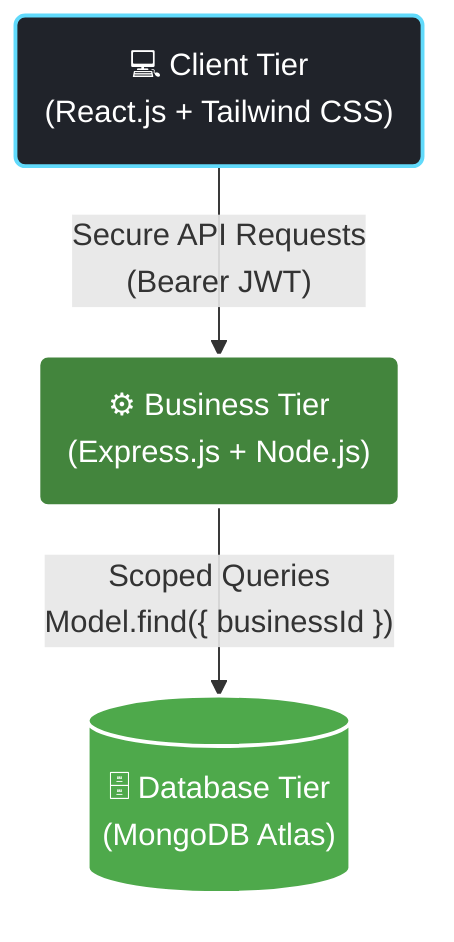

<div align="center">
  
  
  <br />

  [](https://git.io/typing-svg)

  <br />

  <p>
    
    
    
    
    
    
  </p>

  <p><strong>Empower local businesses with enterprise-grade analytics, without the enterprise price tag.</strong></p>
</div>

---

## 🌟 Overview

A high-performance, multi-tenant analytics dashboard built for modern micro-SaaS businesses. Business owners can seamlessly sign up, import historical sales data via CSV, and unlock powerful visual insights. Everything from revenue trends and profit margins to product velocity and low-stock alerts is securely isolated per tenant using scoped compound indexes.

<!-- 
  💡 PRO TIP: Add a GIF of your dashboard in action here!
   
-->

---

## 🏗️ Architecture



---

## ✨ Features

- 🔐 **Multi-Tenant Isolation**: Rock-solid security where every query is strictly scoped by `businessId` via JWT.
- 📈 **KPI Dashboard**: Real-time tracking of Revenue, Profit, Average Ticket Value, and Low Stock Alerts.
- 🎨 **Interactive Charts**: Beautiful visualizations including Area (revenue), Bar (top products), and Donut (payment split) charts.
- 📦 **Product Management**: Complete CRUD operations combined with lightning-fast CSV bulk imports.
- 🛒 **Sales Recording**: Multi-item transaction logging with automatic inventory decrementing.
- 🧠 **MongoDB Aggregations**: Complex analytical computations handled entirely server-side for maximum client performance.
- 📄 **PDF Reports**: Instant generation of downloadable financial ledgers.
- 📧 **Automated Alerts**: Low stock email notifications powered by Nodemailer.
- 📱 **Responsive Design**: Flawless mobile-first experience wrapped in a stunning glassmorphism dark theme.

---

## 🚀 Quick Start

### Prerequisites
- Node.js v18+
- MongoDB Atlas account (or local MongoDB instance)

### 1️⃣ Backend Setup
```bash
cd server
npm install
# Edit .env with your configuration
npm run dev
```

### 2️⃣ Frontend Setup
```bash
cd client
npm install
npm run dev
```

> **Note**: The application will be accessible at `http://localhost:5173`.

---

## 📁 Sample Data

Jumpstart your testing by importing our curated sample datasets located in the `samples/` directory:
- 🛒 **`sample_products.csv`** — 15 sample products to populate your inventory.
- 💰 **`sample_sales.csv`** — 30 historical transactions to instantly generate analytics.

---

## 🔧 Environment Variables

Create a `.env` file in the `server` directory using the following template:

```env
MONGO_URI=mongodb+srv://<username>:<password>@cluster.mongodb.net/
JWT_SECRET=your_super_secret_jwt_key
JWT_EXPIRES_IN=30d
PORT=5000
SMTP_HOST=smtp.gmail.com
SMTP_PORT=587
SMTP_USER=your_email@gmail.com
SMTP_PASS=your_app_specific_password
```

---

<div align="center">
  
  <p>Released under the <a href="./LICENSE">MIT License</a>.</p>
</div>
